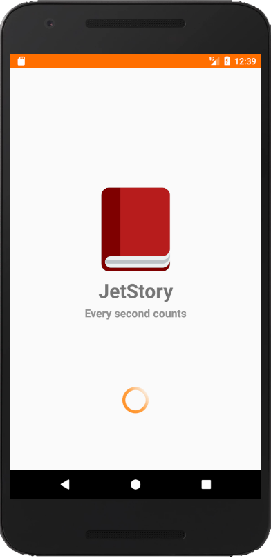
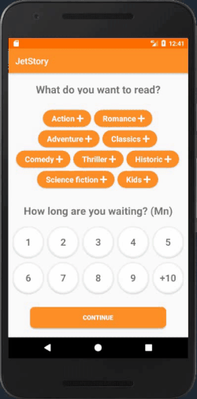
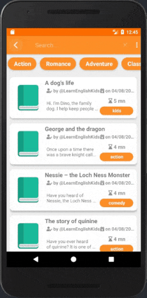
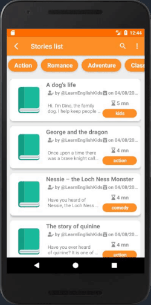
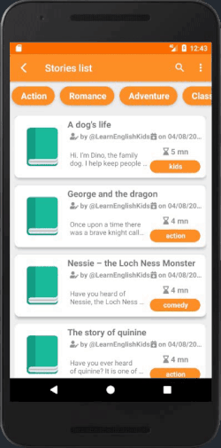

# JetTunes

## Description:
JetStory is an open source android app made to help you spend your waiting time reading stories that have similar length to your available time.
#### Real world example:
  Someone is waiting at the bus station, the bus will arrive in 5 mn, they use JetStory to read a story that is 5 mn long!

## How it works:
* Choose a category and a time to complete the story 

* Choose a story to read! 

* You can search for stories by name or category! 

 

* You can search for words in a story!

## TODO:
- [ ] Add more stories.
- [ ] Open the API to allow people to integrate stories (writter profile).
- [ ] Add users profiles.
- [ ] Adding interaction with stories (likes, comments..).

## Tools & languages (the APP):    
* Android studio (IDE).
* Java (Logic code).
* XML (Design).
* Paint.Net (Image editting).
* [Android Bootstrap](https://github.com/Bearded-Hen/Android-Bootstrap) (Android UI library).
* [FlexBox Layout](https://github.com/google/flexbox-layout) (Android UI library).
* [Font Awesome](https://fontawesome.com) (Custom icons).

## Tools & languages (the API):
* visual studio code (Editor).
* C# (Logic code).
* Dotnet Core (Framework).

## Contribution:
Feel free to `fork` this project and add whatever you like. If you have any suggestions or any comments please feel free to contact me or to open an issue, use free license art assets please.

## Team:
[Jetlighters](https://github.com/JetLightStudio) having fun.
